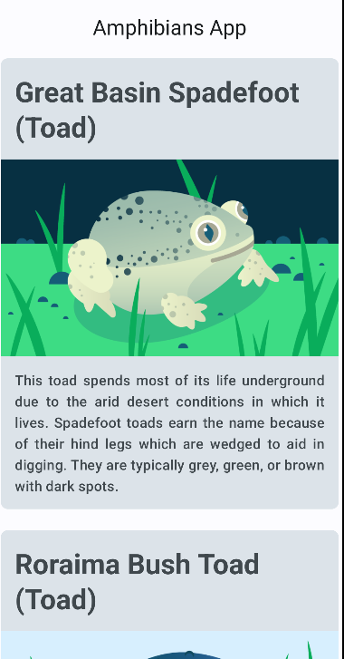

## Android
This Repo contains different Android Projects that I have worked on while following the Google's [Android Basics with Compose Online](https://developer.android.com/courses/android-basics-compose/course) Course.

## Projects
### Amphibian App
An app to display a list of amphibians, along with their details and image. The data is retrieved from the internet by making a network request and contains each amphibian's name, type, description, and image URL.

  

